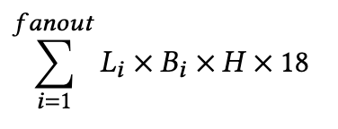

We can execute 'memory_estimation.py' to collect inforamtion to estimate the memory consumption in advance.  
For example, we use 1-layer GraphSage model + LSTM aggregator using dataset OGBN-arxiv

OGBN-arxiv  
*-----------------------  
Nodes: 169343    
Edges: 2315598  
Train: **90941**  
Val: 29799  
Test: 48603  
Classes: 40  
*-----------------------

The in-degree distribution of the output nodes   
{1: 13428, 2: 11706, 3: 9277, 4: 7320, 5: 6222, 6: 4868, 7: 4045, 8: 3472, 9: 2976, 10: 27627}  
(The total of the output nodes is 90941) 
The number of input nodes: 145047  
The estimation of lstm aggregator memory consumption   
  
 
Given an in-degree $L_i$, the number of nodes with the same in-degree $L_i$ is $B_i$.  
The constant 18 in above Equation is an implementation-dependent. Using PyTorch, the
number of intermediate results generated per node is 18.  
H: hidden size is 128  
The datatype is int32 (4 bytes)  
Each item of **CUDA max memory consumption** equals $L_i$ x $B_i$ x 128 x 18 x 4 bytes  in below table.  
| degree    |   1        |      2    |       3   |     4    |     5    |     6     |    7      |     8    |    9      |     10    |   
|-----------|:----------:|----------:|----------:|---------:|---------:|----------:|----------:|---------:|----------:|----------:|
| L         |    1       |     2     |       3   |     4    |     5    |     6     |    7      |     8    |    9      |     10    |  
| B         |    13428   |   11706   |   9277    |    7320  |    6222  |   4868    | 4045      |   3472   |   2976    |   27627   |
| CUDA max memory consumption (GB)| 0.11525 |0.20094| 0.23887 | 0.25131|0.26701|0.25069| 0.24302|0.23840  |  0.22988  |   2.3712  |

sum of estimated memory consumption equals 4.40GB  
the real memory consumption collected from mini batch training is 4.32208-0.074145 = 4.25GB  
The estimate error is  
(4.40-4.25)/4.25 = 0.15/4.25 = 3.53%  
